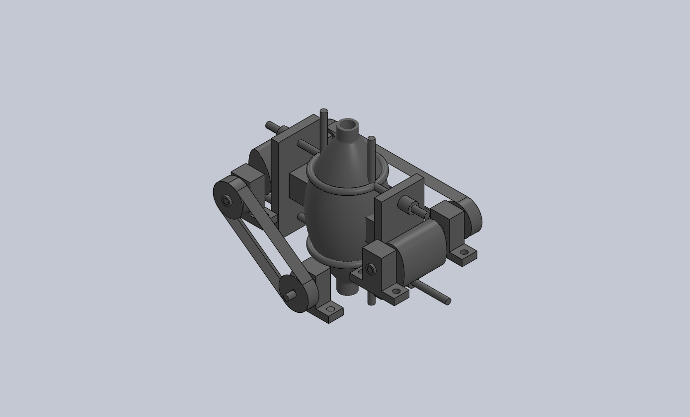

# Propulsion Mechanism Design

## Overview

The propulsion mechanism of the biomimetic jellyfish-inspired underwater robot
is designed based on the **pulsed jet propulsion principle** observed in real jellyfish.
Instead of relying on rotating propellers, the robot generates thrust by
periodically expelling water from an internal chamber, producing a reaction force
along the body axis.

This propulsion strategy enables low-noise, smooth underwater motion and
improves environmental compatibility.

---

## Propulsion Principle Illustration

A schematic view of the pulsed jet propulsion mechanism.
The elastic chamber periodically contracts and expands,
expelling water to generate thrust along the vertical axis.

## Biological Inspiration

Jellyfish achieve locomotion by rhythmically contracting and relaxing their bell-shaped bodies.
During contraction, water is expelled from the internal cavity, generating thrust.
During relaxation, water is drawn back into the cavity, preparing for the next propulsion cycle.

This project abstracts the biological motion into two essential phases:

1. **Water Intake Phase**
2. **Water Expulsion Phase**

These phases are mechanically reproduced using a simplified actuation system.

---

## Mechanical Implementation
## Experimental Demonstration

The following video demonstrates the working principle of the pulsed jet propulsion mechanism:

[▶ View propulsion mechanism demonstration](renders/propulsion_demo.mp4)

### Actuation Principle

The propulsion mechanism uses an electric motor to drive a mechanical linkage
that periodically compresses and releases an elastic water chamber.

Key components include:

- Electric motor  
- Lever or cam-based transmission mechanism  
- Elastic water chamber (water bladder)  
- One-way water inlet and outlet paths  

The motor converts rotational motion into reciprocating linear motion,
which drives the cyclic deformation of the water chamber.

---

### Water Intake Phase

During the intake phase:

- The motor drives the linkage to gradually release compression on the elastic chamber  
- The chamber expands, increasing its internal volume  
- Surrounding water is drawn into the chamber  

This phase is designed to occur relatively slowly to minimize backward thrust
and energy loss.

---

### Water Expulsion Phase

During the expulsion phase:

- The motor rapidly compresses the elastic chamber  
- Water is expelled through the outlet  
- The reaction force generated by the expelled jet propels the robot forward  

The expulsion phase is designed to be faster than the intake phase,
maximizing net forward thrust over each propulsion cycle.

---

## Thrust Generation Characteristics

The thrust generated by the pulsed jet propulsion mechanism depends on:

- Volume change of the water chamber  
- Expulsion velocity of the water jet  
- Frequency of propulsion cycles  

By adjusting motor speed and actuation timing,
the propulsion frequency and thrust magnitude can be controlled.

---

## Engineering Design Considerations

Several engineering trade-offs were considered during the design process:

- **Thrust vs. Energy Efficiency**  
  Higher expulsion speed increases thrust but also increases power consumption.

- **Chamber Elasticity**  
  The elastic properties of the water chamber affect responsiveness and durability.

- **Mechanical Simplicity**  
  The mechanism prioritizes structural simplicity to improve reliability
  and ease of maintenance.

---

## Advantages of Pulsed Jet Propulsion

Compared with propeller-based propulsion, the proposed mechanism offers:

- Reduced acoustic noise  
- Improved stealth and environmental compatibility  
- Lower risk of entanglement with aquatic plants or debris  
- Closer resemblance to natural aquatic locomotion  

---

## Limitations and Future Improvements

Current limitations of the propulsion mechanism include:

- Limited maximum speed compared to propeller-driven systems  
- Dependence on elastic material durability  

Future improvements may include:

- Optimization of chamber geometry  
- Adaptive control of propulsion frequency  
- Integration of flexible or soft robotic materials  

---

---

# 推进机构设计说明（中文版）

## 总体概述

本仿生水母水下机器人的推进机构
基于水母自然运动中的**反冲喷射推进原理**进行设计。
与传统旋转式螺旋桨推进不同，
该机器人通过周期性地将腔体内水体喷出，
在身体轴向方向产生反向推力，从而实现水下运动。

该推进方式运动平稳、噪声较低，
更适合对水生环境友好的应用场景。

---

## 生物运动机理启发

水母通过有节律地收缩与舒张伞状外壳实现运动：

- 收缩阶段：挤压内腔，水体被喷出，产生推进力  
- 舒张阶段：内腔体积增大，水体被吸入，为下一次推进做准备  

本项目将这一生物过程抽象为两个基本阶段：

1. **吸水阶段**
2. **喷水阶段**

并通过机械结构对其进行工程化实现。

---

## 机械实现方式

### 驱动原理

推进机构采用电机作为驱动源，
通过杠杆或凸轮等传动机构，
将电机的旋转运动转化为往复直线运动，
周期性挤压弹性水囊。

主要组成部件包括：

- 电机  
- 机械传动结构（杠杆 / 凸轮）  
- 弹性水囊  
- 单向进水与出水通道  

---

### 吸水阶段

在吸水阶段：

- 电机驱动机构逐渐释放对水囊的挤压  
- 水囊体积增大  
- 外部水体被吸入腔体  

该阶段设计为相对缓慢，
以减少反向推力并提高整体推进效率。

---

### 喷水阶段

在喷水阶段：

- 电机快速挤压水囊  
- 水体通过出水口高速喷出  
- 喷射水流产生的反作用力推动机器人前进  

通过控制喷水阶段的速度与时序，
可有效提高单周期的净推进效果。

---

## 推力特性分析

推进产生的推力主要受以下因素影响：

- 水囊体积变化量  
- 水体喷射速度  
- 推进循环频率  

通过调节电机转速与控制策略，
可以实现推进频率与推力大小的调节。

---

## 工程设计权衡

在推进机构设计过程中，
重点考虑了以下工程问题：

- **推力与能耗之间的平衡**  
- **水囊材料的弹性与耐久性**  
- **结构简化以提高可靠性与可维护性**  

---

## 推进方式优势

与传统螺旋桨推进方式相比，
本反冲喷射推进方式具有以下优势：

- 推进噪声低  
- 隐蔽性强，对水生生物干扰小  
- 不易缠绕水草或杂物  
- 更接近自然水生生物运动方式  

---

## 局限性与改进方向

当前推进机构仍存在一定局限：

- 最大航速受限  
- 弹性水囊材料存在疲劳问题  

后续可通过以下方向进行改进：

- 优化水囊形状与结构  
- 引入自适应推进控制策略  
- 采用柔性或软体机器人材料  
